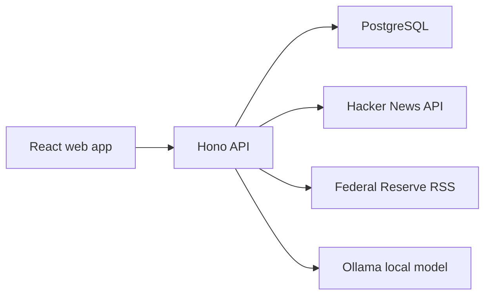
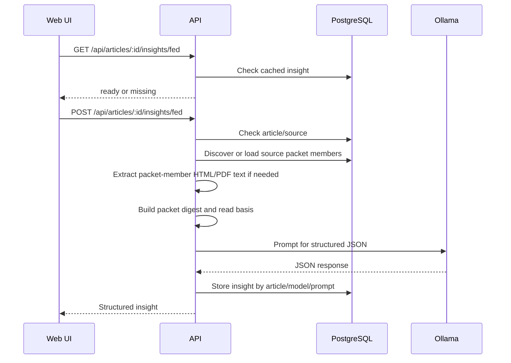

# Architecture

## Overview

News Aggregator is a TypeScript monorepo for ingesting articles from multiple sources, storing normalized article records in PostgreSQL, building cached feed snapshots, and generating in-house AI insights for Federal Reserve releases.

The app is split into:

- `apps/web`: React, Vite, Tailwind, TanStack Query UI.
- `apps/api`: Hono API, Better Auth, source ingestion, feed ranking, article insights.
- `packages/db`: Drizzle schema, database client, migration runner.

The intended local startup path is:

```sh
pnpm dev:docker
```

This uses `docker-compose.dev.yml` as a standalone dev stack. PostgreSQL and Ollama still run as normal containers, while `api` and `web` run from plain Node containers in watch mode with the workspace mounted in so frontend and backend edits apply without rebuilding images on every change.

For a more deployment-like stack, use:

```sh
pnpm stack:docker
```

## Runtime Topology



The browser does not fetch source feeds or call the model directly. It calls the API, and the API owns ingestion, ranking, persistence, auth, and AI orchestration.

## Source Ingestion

Source adapters live in `apps/api/src/adapters`.

Each adapter implements:

```ts
type SourceAdapter = {
  key: string;
  name: string;
  slug: string;
  homepageUrl: string;
  fetchTopArticles(): Promise<SourceArticleInput[]>;
};
```

Current adapters:

- `hacker-news`: fetches Hacker News top stories through the Firebase API.
- `federal-reserve-monetary-policy`: fetches Federal Reserve monetary policy releases through RSS.
- `bank-of-canada-monetary-policy`: fetches Bank of Canada monetary policy releases through RSS.

`ingestFromAdapter` upserts the source, articles, and source-specific signals. Articles are canonicalized into the `articles` table while raw source payloads remain in `articles.raw` and normalized signal fields live in `article_signals`.

## Feed Ranking

Feed snapshots are generated by `refreshRankedFeeds`.

The current feed keys are:

- `top-now`
- `today`
- `week`
- `latest`

`top-now` is source-balanced: it takes the 10 newest articles from each source, merges those per-source lists, then sorts the combined result by `publishedAt` descending.

`latest` takes the 30 newest articles globally.

`today` and `week` filter by time window and sort by normalized score. Engagement sources use points, comments, source rank, and age. Official policy sources currently use recency-derived scoring.

The ranked output is stored in `ranked_feed_items`, so feed reads are fast and stable until the next refresh.

## Auth and Bookmarks

Better Auth is mounted at:

```txt
/api/auth/*
```

Better Auth tables are defined in `packages/db/src/schema.ts`.

Anonymous users can read feeds and cached insights. Authenticated users can bookmark articles through:

```txt
POST /api/bookmarks/:articleId
DELETE /api/bookmarks/:articleId
```

Source refresh, feed refresh, and AI generation are also authenticated because they can trigger external requests, database writes, and local model work. There is no admin role yet; this is a prototype-level guardrail before adding proper roles/rate limits.

For local development, `pnpm seed:dev-admin` creates a Better Auth email/password account through the same server-side sign-up API used by the app. The default credentials are documented in `README.md` and can be overridden with `DEV_ADMIN_*` environment variables.

## In-House AI Insights

AI insights are backend-owned and use an Ollama-compatible local model API. The app does not call OpenAI, Claude, or another hosted AI provider.

Current defaults:

```txt
OLLAMA_BASE_URL=http://ollama:11434
OLLAMA_MODEL=llama3.2:1b
OLLAMA_KEEP_ALIVE=30m
OLLAMA_CHAT_TIMEOUT_MS=240000
```

Policy macro reads now use a **Source Packet** pipeline for official policy sources:

- ingestion discovers one-hop, authoritative-host packet members
- packet members are persisted explicitly
- extraction and packet digest assembly happen on demand
- the model reads the packet digest rather than a single page blob

Insight generation flow:



Successful insights are cached in `article_insights` by:

```txt
article_id + insight_type + model_id + prompt_version
```

To reduce first-request latency after the stack boots, the API sends a tiny background warm-up request to Ollama on startup and asks Ollama to keep the configured model resident for `OLLAMA_KEEP_ALIVE`. This does not remove inference cost, but it helps avoid making the first real Fed summary request pay the full model-load penalty.

The UI prefetches cached Fed insights on hover using `GET`; it only generates with authenticated `POST` after an explicit `Analyze` click. The API also deduplicates concurrent in-flight generation requests for the same article/model/prompt key inside a single API process.

## Frontend Data Flow

The frontend uses TanStack Query for API state.

Primary calls:

- `GET /api/feeds/:feedKey`
- `POST /api/ingest/all`
- `GET /api/articles/:articleId/insights/fed`
- `POST /api/articles/:articleId/insights/fed`
- `GET /api/articles/:articleId/reads/policy-macro`
- `POST /api/articles/:articleId/reads/policy-macro`

Rows are expandable:

- Non-Fed rows show source summary/signals.
- Fed rows show source summary plus cached/generated AI insight controls.

## Database Tables

Core content:

- `sources`
- `articles`
- `article_signals`
- `article_scores`
- `ranked_feed_items`

AI:

- `source_packet_members`
- `packet_digests`
- `article_insights`

User/auth:

- `user`
- `session`
- `account`
- `verification`
- `bookmarks`

Migration SQL is generated by Drizzle Kit. Runtime migration application uses the local `packages/db/src/migrate.ts` runner, which records applied files in `app_migrations`.

## Known Tradeoffs

- Ingestion and ranking are triggered manually through API/UI buttons; there is no scheduler yet.
- Source adapters are registered manually in `server.ts`; there is no adapter registry abstraction yet.
- The AI insight path is synchronous; long-running model calls occupy the request until complete, although same-key in-flight requests are deduplicated per API process.
- Failed insight attempts are not persisted, only successful insights are cached.
- HTML discovery and extraction are still regex-based and intentionally simple. They are acceptable for the first source-packet slice, but not a robust general parser. User-submitted URLs are still deferred; before enabling them, add URL allowlisting, private-network blocking, redirect limits, and response size limits.
- Packet discovery is intentionally one-hop and allowlist-driven. It will miss useful supporting material if a source hides documents behind scripts or secondary navigation until that source gets a more specific adapter rule set.
- The Hono server file currently owns route registration for ingestion, feeds, insights, bookmarks, and auth, so it will need route modularization as features grow.
